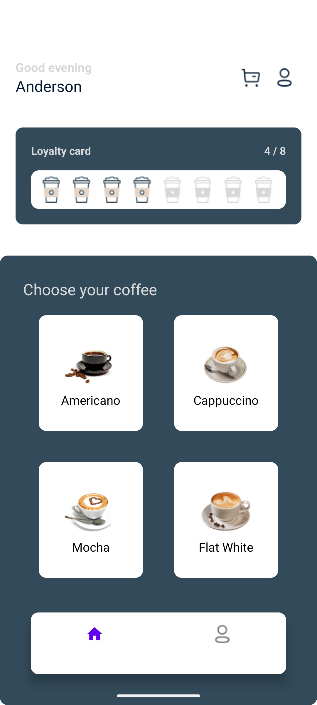
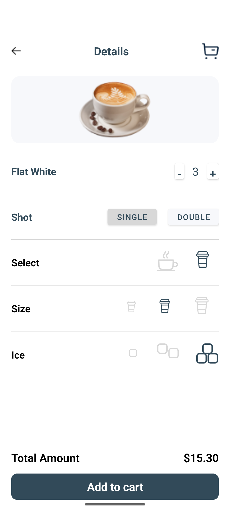
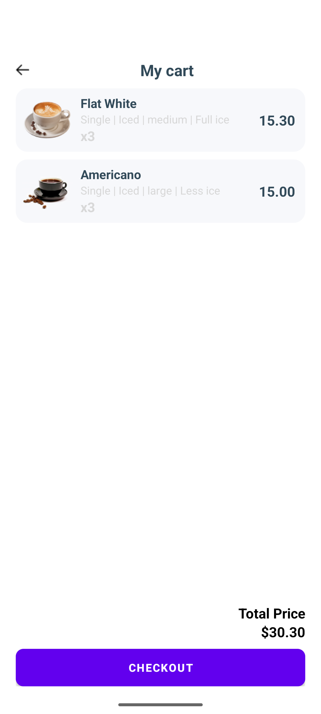
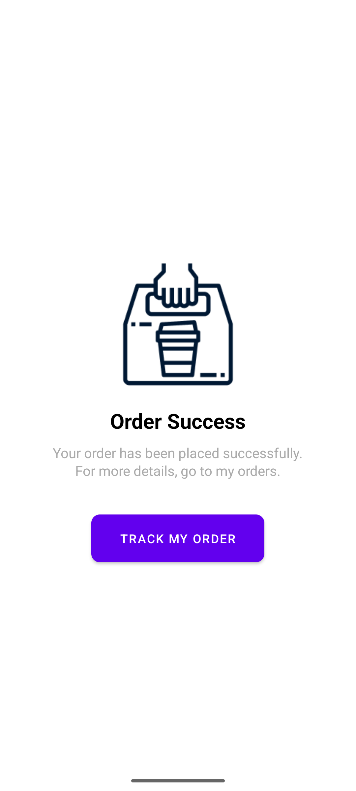
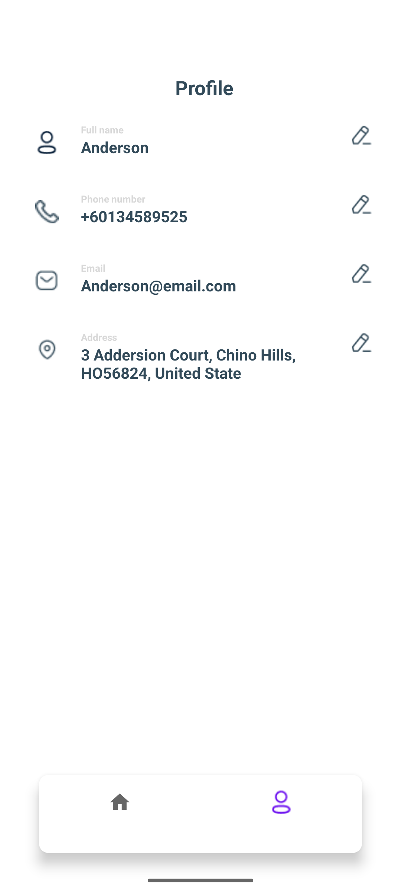

# Android Coffee Store Application

## Introduction

This project is part of the Mobile Application Development course, showcasing the development of an Android-based Coffee Store application.

## About the Code

- Programming Language: Java
- Frameworks: No additional frameworks used
- Architecture: Organized using the [MVVM (Model-View-ViewModel pattern)](https://www.digitalocean.com/community/tutorials/android-mvvm-design-pattern)

## Demo

Watch the demo video of the app [here](demo.mp4).

## Screenshots

Here are some screenshots of the app:

## APK

You can download the APK by clicking [app-debug.apk](app-debug.apk).

## Future Enhancements

- Integrate an API to enhance functionality
- Complete the unfinished screens
- Improve UI/UX for a better user experience
